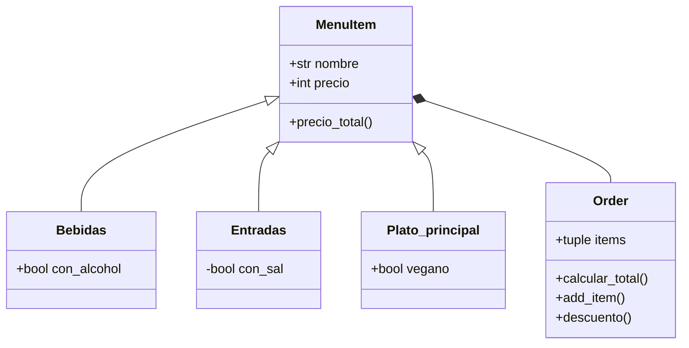

# Reto3_POO
### Katherine Restrepo
####1. Crear una clase linea
####2. Redefine the class Rectangle, adding a new method of initialization using 4 Lines (composition at its best, a rectangle is compose of 4 lines).

```python
class Point:
  definition: str = "Entidad geometrica abstracta que representa una ubicación en un espacio."
  def __init__(self, x: float=0, y: float=0):
    self.x = x
    self.y = y
  def move(self, new_x: float, new_y: float):
    self.x = new_x
    self.y = new_y
  def reset(self):
    self.x = 0
    self.y = 0
  def __str__(self):
     return f"({self.x},{self.y})"

class Line:
    def __init__(self, length:float, slope:float,start: Point = Point(0,0), end: Point = Point(0,0)):
        self.length=length
        self.slope=slope
        self.start=start
        self.end=end

    def compute_length(self)-> float:
        self.length=(((self.start.x-self.end.x)**2+(self.start.y-self.end.y)**2)**0.5)
        return self.length

    def compute_slope(self) -> float:
        self.slope=((self.end.y-self.start.y)/(self.end.x-self.start.x))
        return self.slope

    def compute_horizontal_cross(self)-> Point:
        punto_corte_x=self.start.x-(self.start.y/self.slope)
        return Point(punto_corte_x,0)
    
    def compute_vertical_cross(self) -> Point:
        punto_corte_y=self.start.y-(self.start.x*self.slope)
        return Point(0,punto_corte_y)

dato1=Line(0,0,start=Point(2,4),end=Point(6,6))
print(dato1.compute_lenght())
print(dato1.compute_slope())
print(str(dato1.compute_horizontal_cross()))
print(str(dato1.compute_vertical_cross()))

class Rectangle:
    def __init__(self, *args):
        if len(args)==3:
            vertice_inf_izq, width, height=args
            self.width=width
            self.height=height
            centro_x=vertice_inf_izq.x+width/2
            centro_y=vertice_inf_izq.y+height/2
            self.center=(Point(centro_x,centro_y))

        elif len(args)==3 and isinstance(args[0],Point):
            center, width, height=args
            self.width=width
            self.height=height
            self.center=center
        
        elif len(args)==2 and all(isinstance(arg,Point) for arg in args):
            vertice_1,vertice_2=args
            self.width=abs(vertice_1.x-vertice_2.x)
            self.height=abs(vertice_1.y-vertice_2.y)
            centro_x=(vertice_1.x+vertice_2.x)/2
            centro_y=(vertice_1.y+vertice_2.y)/2
            self.center=(centro_x,centro_y) 
        
        elif len(args)==4 and all(isinstance(arg,Line)for arg in args):
            linea1, linea2, linea3, linea4 = args
            vertice_inf_izq = args[0].start
            vertice_sup_derecho = args[2].end
            self.width = abs(vertice_sup_derecho.x - vertice_inf_izq.x)
            self.height = abs(vertice_sup_derecho.y - vertice_inf_izq.y)
            centro_x=vertice_inf_izq.x+width/2
            centro_y=vertice_inf_izq.y+height/2
            self.center=(centro_x,centro_y)

    def compute_area(self):
        return self.width*self.height
        
    def compute_perimeter(self):
        return 2*(self.width+self.height)   
    
    def compute_interference_point(self,punto:Point)-> bool:
        return(
        self.center.x-self.width/2<= punto.x<=self.center.x+self.width/2 and 
        self.center.y-self.height/2<= punto.y<=self.center.y+self.height/2
        )
    
    def line_intersect(self,punto_1:Point,punto_2:Point)-> bool:
        if self.compute_interference_point(punto_1)or self.compute_interference_point(punto_2):
            return True
        return False
```


####Restaurant scenario: You want to design a program to calculate the bill for a customer's order in a restaurant.
Create a class diagram with all classes and their relationships.



```python
class MenuItem:
    def __init__(self,nombre:str,precio:float):
        self.nombre=nombre
        self.precio=precio

    def calculate_total_price(self):
        return self.precio
        
class Bebida(MenuItem):
    def __init__(self, nombre, precio, con_azucar:bool=False):
        super().__init__(nombre, precio)
        self.con_azucar=con_azucar


class Entrada(MenuItem):
    def __init__(self, nombre, precio, con_sal:bool=False):
        super().__init__(nombre, precio)
        self.con_sal=con_sal

class PlatoPrincipal(MenuItem):
    def __init__(self, nombre, precio,vegano:bool=False):
        super().__init__(nombre, precio)
        self.vegano=vegano

class Order:
    def __init__(self):
        self.items=[]
    
    def add_item(self,item:MenuItem):
        self.items.append(item)

    def calcular_total(self):
        total=sum(item.calculate_total_price() for item in self.items)
        return total
    
    def descuento(self, porcentaje:float):
        total=self.calcular_total()
        total= total-(total*porcentaje/100)
        return total

orden=Order()
orden.add_item(Bebida("Cafe", 2.5, False))
orden.add_item(Entrada("pan", 5, False))         
orden.add_item(Bebida("pasta", 12, False))

print("Total cuenta:", orden.calcular_total())
print("Total con descuento:", orden.descuento(10))
```